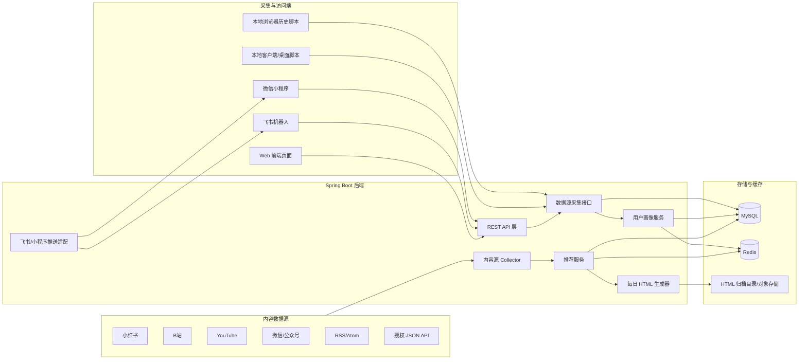

# 个人兴趣助手架构设计

## 1. 整体架构



## 2. 模块划分

| 模块 | 说明 | 当前项目落地情况 |
| --- | --- | --- |
| Client Collector | 本地采集浏览器历史、应用使用、用户主动提交链接 | 已有浏览器历史/应用检测脚本，可继续扩展 |
| DataSource Ingestion API | 统一接收小红书、B站、YouTube、微信等事件 | 已新增 `/api/datasources/**` |
| Activity Service | 行为落库并触发画像学习 | 已有 |
| Profile Service | 从行为中抽取关键词并更新兴趣权重 | 已有 |
| Platform Collector | 从 Mock/RSS/JSON/X/授权平台拉取候选内容 | 已有接口，后续可新增 Agent Reach 适配器 |
| Recommendation Service | 根据画像、搜索词、新鲜度、反馈生成推荐 | 已有 |
| Daily HTML Page Generator | 每日生成可浏览、可归档 HTML 页面 | 建议下一阶段实现 |
| Mini Program API | 提供小程序画像、上传、推荐接口 | 已有 `/api/mini/**` |
| Feishu Integration | 推送每日推荐 | 已有飞书 webhook 推送 |
| Redis Cache | 缓存画像、推荐、接口热点数据 | 设计建议，后续接入 |

## 3. 数据采集接口

### 单条事件

```http
POST /api/datasources/events
Content-Type: application/json
```

```json
{
  "userId": "alice",
  "platform": "xiaohongshu",
  "type": "FAVORITE",
  "externalId": "note-id",
  "title": "小红书AI效率笔记收藏",
  "url": "https://www.xiaohongshu.com/search_result?keyword=AI%20效率%20笔记",
  "author": "作者名",
  "summary": "用户收藏的小红书效率笔记",
  "text": "补充备注",
  "occurredAt": "2026-06-04T09:00:00",
  "tags": ["小红书", "AI", "效率"]
}
```

### 批量事件

```http
POST /api/datasources/events/batch
Content-Type: application/json
```

```json
{
  "events": [
    {
      "userId": "alice",
      "platform": "bilibili",
      "type": "WATCH",
      "title": "B站 Spring Boot 推荐系统视频",
      "url": "https://www.bilibili.com/video/BV1demo",
      "tags": ["B站", "Java", "推荐系统"]
    }
  ]
}
```

### 平台快捷入口

```http
POST /api/datasources/{platform}/events
```

适合客户端固定平台时使用，例如：

```http
POST /api/datasources/xiaohongshu/events
```

## 4. 初步数据库表设计

当前项目已有 JPA 实体，下面是面向 MySQL + Redis 的扩展版设计。

### user_activity

| 字段 | 类型 | 说明 |
| --- | --- | --- |
| id | bigint PK | 行为 ID |
| user_id | varchar(64) | 用户 ID |
| type | varchar(32) | SEARCH/VISIT/WATCH/LIKE/FAVORITE/DISLIKE |
| platform | varchar(64) | xiaohongshu/bilibili/youtube/wechat |
| title | varchar(512) | 标题 |
| url | varchar(1024) | 来源链接 |
| text | text | 行为文本、摘要、备注 |
| occurred_at | datetime | 行为发生时间 |

索引建议：

- `(user_id, occurred_at)`
- `(user_id, platform, occurred_at)`
- `(platform, occurred_at)`

### user_activity_tags

| 字段 | 类型 | 说明 |
| --- | --- | --- |
| user_activity_id | bigint | 行为 ID |
| tags | varchar(128) | 标签 |

### interest_term

| 字段 | 类型 | 说明 |
| --- | --- | --- |
| id | bigint PK | 兴趣词 ID |
| user_id | varchar(64) | 用户 ID |
| term | varchar(128) | 兴趣词 |
| weight | double | 权重 |
| hit_count | int | 命中次数 |
| last_seen_at | datetime | 最近出现时间 |

唯一索引：

- `(user_id, term)`

### content_item

| 字段 | 类型 | 说明 |
| --- | --- | --- |
| id | bigint PK | 内容 ID |
| platform | varchar(64) | 内容来源 |
| external_id | varchar(128) | 平台侧 ID |
| title | varchar(512) | 标题 |
| url | varchar(1024) | 链接 |
| author | varchar(128) | 作者 |
| summary | text | 摘要 |
| published_at | datetime | 发布时间 |
| collected_at | datetime | 采集时间 |
| content_hash | varchar(128) | 去重 hash |

唯一索引：

- `content_hash`

### recommendation

| 字段 | 类型 | 说明 |
| --- | --- | --- |
| id | bigint PK | 推荐 ID |
| user_id | varchar(64) | 用户 ID |
| content_item_id | bigint | 内容 ID |
| recommendation_date | date | 推荐日期 |
| score | double | 推荐分数 |
| reason | varchar(512) | 推荐理由 |
| feedback | varchar(32) | NONE/LIKE/DISLIKE/FAVORITE/BLOCK_SOURCE |
| created_at | datetime | 创建时间 |

索引建议：

- `(user_id, recommendation_date, score)`

### daily_page_archive

建议新增，用于记录每日 HTML 归档。

| 字段 | 类型 | 说明 |
| --- | --- | --- |
| id | bigint PK | 归档 ID |
| user_id | varchar(64) | 用户 ID |
| page_date | date | 页面日期 |
| title | varchar(256) | 页面标题 |
| file_path | varchar(512) | 本地路径或对象存储 key |
| public_url | varchar(1024) | 可访问 URL |
| generated_at | datetime | 生成时间 |

唯一索引：

- `(user_id, page_date)`

## 5. Redis 缓存设计

| Key | Value | TTL |
| --- | --- | --- |
| `profile:{userId}:topTerms` | Top 兴趣词 JSON | 10 分钟 |
| `recommend:{userId}:{date}` | 今日推荐 JSON | 默认 12 小时 |
| `refresh-policy:{userId}` | 推荐刷新策略 JSON | 5 分钟 |
| `rate-limit:{userId}` | 接口限流计数 | 1 分钟 |
| `page:{userId}:{date}` | 每日 HTML 地址 | 24 小时 |

## 6. 推荐 HTML 输出方案

### 页面生成时机

- 每天早上定时生成。
- 用户手动点击“生成今日页”。
- 推荐过期后自动刷新并重新生成。

### 页面文件路径

```text
archives/{userId}/2026-06-04.html
```

生产环境建议上传对象存储，例如：

```text
oss://habit-assistant/archives/{userId}/2026-06-04.html
```

### 页面结构

```text
每日兴趣简报
├─ 顶部：日期、用户、刷新时间
├─ 兴趣标签：Top 10 标签和权重
├─ 今日推荐：标题、摘要、推荐理由、来源平台、外链
├─ 来源分布：小红书/B站/YouTube/微信/RSS
├─ 反馈入口：喜欢、不感兴趣、屏蔽来源
└─ 归档导航：前一天、后一天、返回列表
```

### HTML 模板建议

- 使用服务端模板：Thymeleaf 或简单字符串模板。
- 输出静态 HTML，方便归档、备份和通过 Nginx 直接访问。
- 动态反馈按钮仍调用后端 API。

示例片段：

```html
<article class="recommendation">
  <h2><a href="${url}" target="_blank">${title}</a></h2>
  <p>${summary}</p>
  <p class="reason">${reason}</p>
  <span>${platform}</span>
</article>
```

## 7. Agent Reach 渠道接入建议

Agent Reach 适合作为“授权/工具型采集层”，不要把它和业务推荐逻辑耦合。建议新增一个适配器：

```text
AgentReachSourceAdapter
  -> 调用 agent-reach/xhs-cli/bili-cli/yt-dlp
  -> 转成 DataSourceEventRequest 或 CollectedContent
  -> 进入 /api/datasources/events/batch 或 PlatformCollector
```

本地客户端可以直接调用：

```text
Agent Reach CLI
  -> 采集小红书/B站/YouTube
  -> 生成 JSON
  -> POST /api/datasources/events/batch
```

后端保持纯 Spring Boot 服务，不直接依赖本机浏览器 cookie，也不承担绕过平台限制的采集逻辑。
