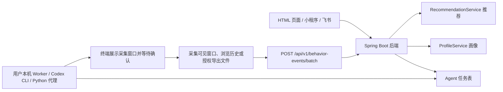

# 本地 Agent 与 Codex CLI 调度方案

## 1. 当前项目能做到什么

当前项目已经形成一个“后端兴趣画像服务 + 本地授权采集端”的架构。

后端能力：

- 接收行为事件：`POST /api/v1/behavior-events/batch`
- 保存浏览、搜索、观看、收藏、点击、不感兴趣等行为
- 按 `userId` 生成用户画像
- 统计 7 天和 30 天兴趣标签
- 生成今日推荐：`GET /api/v1/recommendations/today`
- 接收点击和不感兴趣反馈，回流更新标签权重
- 支持 MySQL 存储，Redis/RabbitMQ 可选

本地采集能力：

- PowerShell 脚本导入浏览器历史
- PowerShell 脚本检测指定应用使用情况
- Python 本地代理采集当前可见应用窗口
- 用户主动上传小红书、抖音、B站、YouTube、微信等数据

## 2. 能力边界

后端不能直接读取用户电脑上的应用使用情况。原因：

- Spring Boot 如果部署到服务器，它只能访问服务器环境，不能访问用户个人电脑。
- 浏览器历史、窗口标题、应用进程、剪贴板、聊天记录都属于本地敏感数据。
- 小红书、抖音、微信、B站等平台的个人使用记录通常没有稳定开放 API。
- 项目不应模拟登录、绕过风控或读取 Cookie/Token/聊天内容。

因此，正确架构不是：

```text
远端 Spring Boot -> 直接读取用户电脑
```

而是：

```text
远端/本地 Spring Boot -> 创建采集任务
用户本机 Local Agent/Codex CLI Worker -> 用户确认 -> 本机采集 -> 回传后端
```

## 3. 推荐架构



## 4. PowerShell/命令行如何运行

### 4.1 预览本机应用窗口

不会上传，只查看脚本能采集到什么：

```powershell
py -3 .\scripts\codex_app_proxy.py --user-id alice --dry-run
```

如果本机没有安装正式 Python，而 `py` 或 `python` 指向 Microsoft Store 占位符，需要先安装 Python，或者使用 Codex 自带 Python 路径。

### 4.2 采集一次并上传

默认会先列出窗口，并询问是否上传：

```powershell
py -3 .\scripts\codex_app_proxy.py --user-id alice --once --base-url http://localhost:8080
```

终端会显示类似：

```text
Visible application windows to upload:
 1. [browser-edge] msedge pid=1234 title=...
 2. [wechat] WeChat pid=5678 title=...
Upload these app usage events to backend? [y/N]
```

输入 `y` 才会上传。

### 4.3 自动上传，跳过确认

仅建议自己本地测试时使用：

```powershell
py -3 .\scripts\codex_app_proxy.py --user-id alice --once --yes --base-url http://localhost:8080
```

### 4.4 启动本地代理服务

```powershell
py -3 .\scripts\codex_app_proxy.py --serve --user-id alice --port 8765
```

可用接口：

| Method | Path | 说明 |
| --- | --- | --- |
| `GET` | `http://127.0.0.1:8765/health` | 本地代理健康检查 |
| `GET` | `http://127.0.0.1:8765/apps` | 查看当前可见应用窗口 |
| `POST` | `http://127.0.0.1:8765/collect/apps` | 采集并上传应用行为 |
| `POST` | `http://127.0.0.1:8765/proxy/behavior-events/batch` | 转发 behavior batch |

## 5. 后端如何“调用 Codex CLI”

更准确的说法是：后端不要直接调用用户电脑上的 Codex CLI，而是创建任务，由用户本机 worker 领取任务。

建议接口：

```text
POST /api/agent/queries
POST /api/agent/queries/claim-next
POST /api/agent/queries/{taskId}/result
```

流程：

1. 前端点击“请求本机采集”。
2. 后端创建 `PENDING` 任务。
3. 用户在本机 PowerShell 运行 worker。
4. worker 领取任务，展示即将采集的范围。
5. 用户确认。
6. worker 调用本机脚本或 Codex CLI 工具。
7. worker 将结构化结果回传后端。
8. 后端写入行为表，刷新画像和推荐。

## 6. 采集内容建议

可以采集：

- 当前可见窗口标题
- 进程名
- 浏览器历史中的 URL、标题、访问时间
- 用户主动导出的 CSV/JSON
- 用户主动复制提交的链接和标签

不建议采集：

- Cookie、Token、Session
- 账号密码
- 聊天内容
- 支付记录
- 通讯录
- 未经授权的平台私有数据
- 绕过平台限制得到的数据

## 7. 后续优化路线

第一阶段：当前可落地

- 使用 `scripts/codex_app_proxy.py` 手动采集可见窗口
- 使用浏览器历史导入脚本
- 使用小程序/飞书/网页主动提交数据

第二阶段：更像产品

- 做一个常驻托盘 Local Agent
- Agent 定时提醒用户确认上传
- Agent 本地脱敏、去重、聚合后再上传
- 后端只保存必要字段

第三阶段：接入 AI

- 后端创建“总结兴趣变化”的任务
- 本地或云端 AI 生成摘要
- 推荐服务用向量检索和大模型重排提升质量
